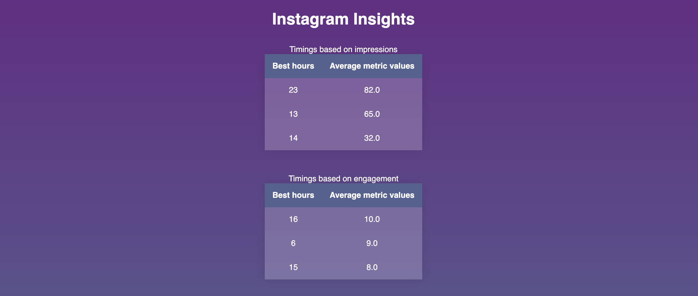

#### Partial report screenshot

## Quickstart

`get_insta_insights.py --page-id=124567890123 --token=098754321234567890`

- Page ID and Token must be provided either as option or environment variable values. 
- If both are provided options will be preferred.

#### Options supported

| Short options | Long options | Environment variables |
|---------------|--------------|-----------------------|
| -h | --help ||
| -m | --machine-learning ||
| | --page-id | FB_PAGE_ID|
| | --token   | FB_TOKEN  |

#### Python version

- \>= 3.6

#### Packages needed
- numpy
- pandas
